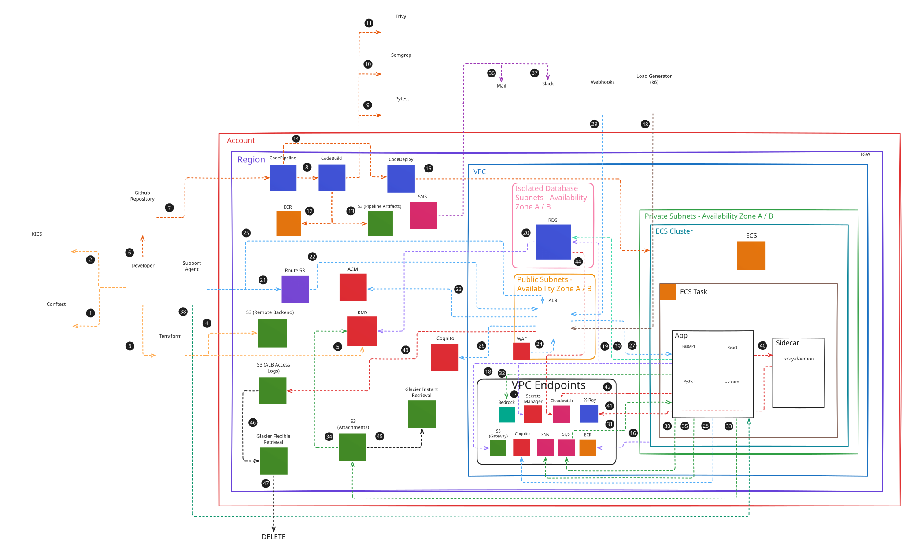
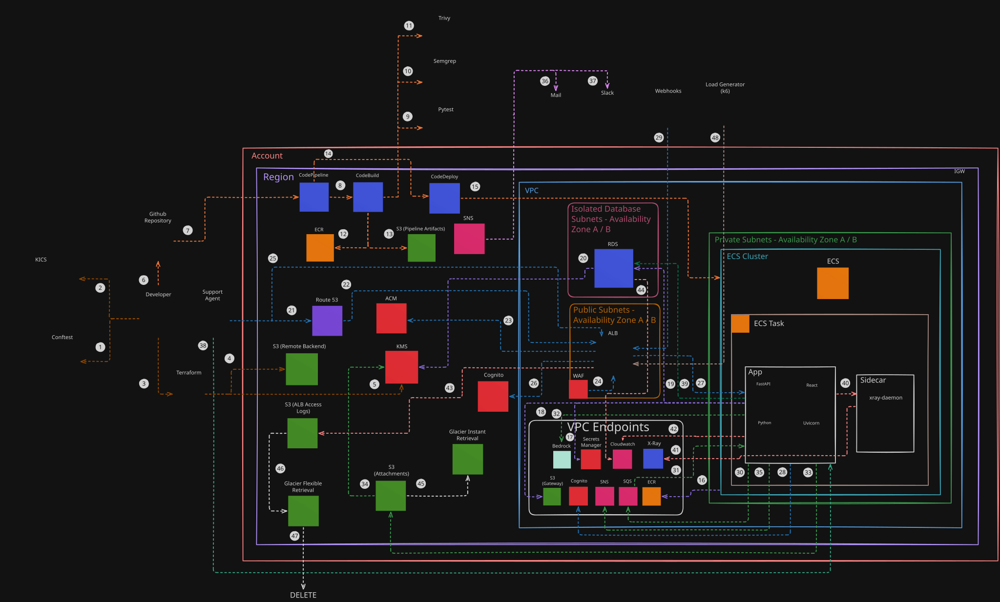

# Customer Inquiry Manager

Automatically routes and triages customer inquiries from emails, web forms, and webhooks. Uses AWS Bedrock to extract urgency, sentiment, and key details, calculates SLA deadlines deterministically, and prepares response drafts for agents to review before sending.

## Architecture

### Light Mode


### Dark Mode


## Video Demo & Walkthrough

Click on the image below to watch the full demonstration and technical explanation of the project on YouTube:

[](https://youtu.be/_ZljpEMZX30)

## What it does

- Ingests inquiries by email (SES MX + IMAP poller), web form, Trustpilot and billing webhooks.
- Enqueues every webhook into `inquiries.fifo` (SQS FIFO) and returns `202 Accepted`, so no request waits on the LLM.
- Extracts urgency, impact, sentiment, churn risk, department and entities in a single Bedrock `Converse` call, temperature 0.
- Assigns a deterministic ITIL v4 priority (P1–P4) and computes FRT and resolution deadlines.
- Freezes the SLA clock when an operator requests more information and resumes it on customer reply.
- Drafts operator replies (`REPLY`, `REQUEST_INFO`, `INTERNAL_NOTE`) grounded in `company_profile.json`.
- Sends customer email via SES, operator alerts via SNS and Slack.
- Runs on Fargate Spot behind an ALB with no NAT Gateways, reaching AWS only through PrivateLink.

## Stack

| Layer | Technology |
| :--- | :--- |
| Backend | FastAPI, SQLAlchemy 2.0 async, Pydantic v2, Python 3.12 |
| Frontend | React 19, TypeScript (strict), Vite, vanilla CSS custom properties |
| Compute | ECS Fargate Spot, dual container (`app` + `aws-xray-daemon`) |
| Database | RDS PostgreSQL 16.10 (`db.t4g.micro`, 20 GB gp3), SQLAlchemy async |
| AI | Bedrock Converse API, `eu.anthropic.claude-haiku-4-5-20251001-v1:0` |
| Messaging | SQS FIFO + DLQ, SNS, SES (inbound MX and outbound) |
| Identity | Cognito User Pool, TOTP MFA (RFC 6238), RBAC (`Tier1_Agents`, `Operations_Managers`) |
| Network | 3-tier VPC, 10 Interface VPC Endpoints, 1 S3 Gateway Endpoint, no NAT |
| CI/CD | CodePipeline, CodeBuild, ECS rolling deploy, Conftest, KICS, Semgrep, Trivy, Syft |

## Execution map: 48 chronological flows

The diagrams above trace the same system as **48 discrete flows grouped into 10 blocks**. Every flow connects exactly **two** technologies (`Origin → Destination`), numbered in the order they execute. This is the reading order for the architecture: governance first, then delivery, then runtime, then the request path, then what a human does, then telemetry and storage lifecycle.

Dashed links in the diagrams are cryptographic and policy transitions (KMS, WAF, S3 lifecycle) rather than data-plane traffic.

| Block | Domain | Flows |
| :--- | :--- | :---: |
| 1 | IaC, Policy-as-Code Governance & Remote State | 1 – 5 |
| 2 | CI/CD & DevSecOps (SAST, SCA, SBOM) | 6 – 15 |
| 3 | Fargate Bootstrapping, PrivateLink & Database | 16 – 20 |
| 4 | Perimeter Ingress, DNS, WAF & Authentication | 21 – 29 |
| 5 | SQS FIFO Decoupling, Bedrock Inference & Attachments | 30 – 34 |
| 6 | Asynchronous Dispatch, ChatOps & Bi-directional Email | 35 – 37 |
| 7 | Human-in-the-Loop Operations, Threads & SLA Clock | 38 – 39 |
| 8 | Distributed Telemetry & Observability | 40 – 44 |
| 9 | Storage FinOps & S3/Glacier Lifecycle | 45 – 47 |
| 10 | Resilience, Auto-Scaling & Load Testing | 48 |

### Block 1 — IaC, Policy-as-Code Governance & Remote State (1–5)

| # | Flow | What happens |
| :--- | :--- | :--- |
| 1 | `Developer → Conftest (OPA Rego)` | `conftest test` evaluates HCL against Rego policies: 3-tier subnet isolation, no NAT Gateways, mandatory KMS CMK, Multi-AZ enforcement, FinOps tags. Fails fast before anything else runs. |
| 2 | `Developer → KICS (Checkmarx)` | `kics scan -p terraform/` runs 2,000+ security queries against CIS AWS, SOC 2 and PCI-DSS misconfigurations. |
| 3 | `Developer → Terraform` | `terraform/bootstrap` provisions the remote state bucket first, then `init/plan/apply` with federated IAM credentials provisions the VPC, ECS, RDS, SQS, Cognito and the 11 endpoints. |
| 4 | `Terraform → S3 (Remote Backend)` | State is stored over HTTPS in S3 with S3-native conditional-write locking (`use_lockfile = true`), eliminating concurrent-apply races without provisioning a separate lock table. |
| 5 | `Terraform → KMS` | *(dashed)* State is envelope-encrypted at rest with the AWS managed `aws/s3` key, which avoids the per-month cost of a customer managed key. |

### Block 2 — CI/CD & DevSecOps (6–15)

| # | Flow | What happens |
| :--- | :--- | :--- |
| 6 | `Developer → GitHub` | `git push origin main` with GPG-signed commits as the single source of truth. |
| 7 | `GitHub → CodePipeline` | Commit webhook starts the pipeline via CodeStar Connections. |
| 8 | `CodePipeline → CodeBuild` | An ephemeral private-subnet CodeBuild instance receives `buildspec.yml`. |
| 9 | `CodeBuild → Pytest` | `pytest app/tests/` runs the 108-test suite. First quality gate: a failure halts the pipeline. |
| 10 | `CodeBuild → Semgrep` | SAST pass over Python and TypeScript for OWASP Top 10, SQLi and credential flaws. |
| 11 | `CodeBuild → Trivy` | SCA pass on the built image blocks HIGH/CRITICAL CVEs in OS and dependencies. |
| 12 | `CodeBuild → ECR` | Syft generates a CycloneDX SBOM, then the image is pushed to private ECR tagged `:latest` and by commit SHA. |
| 13 | `CodeBuild → S3 (Artifacts)` | `imagedefinitions.json`, `imageDetail.json` and `sbom.json` are uploaded KMS-encrypted. |
| 14 | `CodePipeline → ECS Scheduler` | The native ECS deployment provider runs the rolling update (`min 100%`, `max 200%`). |
| 15 | `ECS Scheduler → ECS Tasks` | Replacement Fargate Spot tasks start with the X-Ray sidecar; ALB health checks gate the drain, with automatic rollback on failure. |

### Block 3 — Fargate Bootstrapping, PrivateLink & Database (16–20)

| # | Flow | What happens |
| :--- | :--- | :--- |
| 16 | `ECS Cluster → VPC Endpoint: ECR` | The agent pulls image manifests and layers over PrivateLink, with no public transit. |
| 17 | `App (FastAPI) → VPC Endpoint: Secrets Manager` | At startup the task role fetches RDS credentials and webhook secrets. Zero plaintext credentials. |
| 18 | `App (FastAPI) → VPC Endpoint: S3 (Gateway)` | `company_profile.json` is cached into RAM as grounding context before the readiness probe passes. |
| 19 | `App (FastAPI) → RDS (PostgreSQL 16)` | SQLAlchemy `asyncpg` opens the connection pool on 5432 with `sslmode=require`. |
| 20 | `RDS → KMS` | *(dashed)* Storage, WAL logs and snapshots are envelope-encrypted with the CMK. |

### Block 4 — Perimeter Ingress, DNS, WAF & Authentication (21–29)

| # | Flow | What happens |
| :--- | :--- | :--- |
| 21 | `Support Agent → Route 53` | DNS resolution of the application FQDN. |
| 22 | `Route 53 → ALB` | Alias record maps to the load balancer, avoiding per-query DNS cost. |
| 23 | `ALB → ACM` | TLS 1.3 termination with an ACM certificate, offloading crypto CPU from Fargate. |
| 24 | `WAF → ALB` | *(dashed)* OWASP Core Rule Sets, SQLi/XSS rules and rate limits inspect every request at the edge. |
| 25 | `Support Agent → ALB` | The authenticated operator session reaches the React console over 443. |
| 26 | `ALB → Cognito` | Unauthenticated requests are redirected to the OAuth2/OIDC endpoint with enforced TOTP MFA. |
| 27 | `ALB → App (FastAPI)` | Approved traffic is forwarded to private tasks on 8000 with `X-Forwarded-For` and `X-Amzn-Oidc-Data`. |
| 28 | `App (FastAPI) → VPC Endpoint: Cognito` | JWT signatures are verified against the JWKS and RBAC groups (`Tier1_Agents`, `Operations_Managers`) extracted. |
| 29 | `Webhooks (5 sources) → ALB` | SES email, web form, Trustpilot, Google Reviews and billing POST signed payloads into `/api/v1/webhooks/*`. |

### Block 5 — SQS FIFO Decoupling, Bedrock Inference & Attachments (30–34)

| # | Flow | What happens |
| :--- | :--- | :--- |
| 30 | `App (FastAPI) → VPC Endpoint: SQS` | Signatures are validated and the payload is enqueued into `inquiries.fifo` in under 15ms with SHA-256 deduplication. The client gets `202 Accepted`. Poison messages redrive to `inquiries-dlq.fifo` after 3 attempts and raise a P1 alarm. |
| 31 | `VPC Endpoint: SQS → App (FastAPI)` | A long-polling consumer drains the queue in batches of 10 under a leaky-bucket governor metered to Bedrock TPM/RPM quotas. |
| 32 | `App (FastAPI) → VPC Endpoint: Bedrock` | A single `Converse` call at temperature 0 runs classification, sentiment, urgency/impact, churn risk and entity extraction, wrapped in Bedrock Guardrails (prompt-attack filters and PII redaction). |
| 33 | `App (FastAPI) → S3 (Attachments)` | PDFs and screenshots are uploaded straight to private S3 instead of bloating PostgreSQL. |
| 34 | `S3 (Attachments) → KMS` | *(dashed)* Uploaded objects are envelope-encrypted with the CMK. |

### Block 6 — Asynchronous Dispatch, ChatOps & Bi-directional Email (35–37)

| # | Flow | What happens |
| :--- | :--- | :--- |
| 35 | `App (FastAPI) → RDS + VPC Endpoint: SNS` | The triaged ticket, JSONB entities and SLA deadline are committed atomically, the SQS message is deleted, and the `ticket.created` domain event is published. At-least-once processing with no lost inquiries. |
| 36 | `SNS → Mail` | The customer receives an automated receipt and SLA deadline by email. |
| 37 | `SNS → Slack` | Tickets rated `HIGH` or `CRITICAL` alert the `#ops-critical` ChatOps channel. |

### Block 7 — Human-in-the-Loop Operations, Threads & SLA Clock (38–39)

| # | Flow | What happens |
| :--- | :--- | :--- |
| 38 | `Support Agent → App (FastAPI)` | The operator works the queue: AI drafts in three modes (`REPLY`, `REQUEST_INFO`, `INTERNAL_NOTE`), claims, category overrides and resolution. Customer replies are correlated by `[Ticket #<ID>]` subject matching, which resumes the paused SLA clock and extends the deadline by the paused duration. |
| 39 | `App (FastAPI) → RDS (PostgreSQL 16)` | Messages, `first_responded_at`, `total_paused_seconds` and immutable `inquiry_audit_logs` rows are persisted for SOC 2 and HIPAA auditability. |

### Block 8 — Distributed Telemetry & Observability (40–44)

| # | Flow | What happens |
| :--- | :--- | :--- |
| 40 | `App (FastAPI) → Sidecar (xray-daemon)` | Subsegment timings for SQL, Bedrock, S3 and SQS are emitted over local UDP, adding no latency to request threads. |
| 41 | `Sidecar (xray-daemon) → VPC Endpoint: X-Ray` | Buffered trace segments are flushed in batches over PrivateLink. |
| 42 | `App (FastAPI) → VPC Endpoint: CloudWatch` | The `awslogs` driver streams structured JSON and Embedded Metric Format metrics. |
| 43 | `ALB → S3 (Access Logs)` | *(dashed)* Compressed access logs are written every 5 minutes for forensics and Athena queries. |
| 44 | `RDS → VPC Endpoint: CloudWatch` | Enhanced Monitoring, Performance Insights, CPU and connection metrics feed saturation alarms. |

### Block 9 — Storage FinOps & S3/Glacier Lifecycle (45–47)

| # | Flow | What happens |
| :--- | :--- | :--- |
| 45 | `S3 (Attachments) → Glacier Instant Retrieval` | *(dashed)* Attachments older than 60 days move to `GLACIER_IR`, cutting cost ~68% while keeping millisecond retrieval. |
| 46 | `S3 (Access Logs) → Glacier Flexible Retrieval` | *(dashed)* Logs older than 30 days archive to `GLACIER`. |
| 47 | `Glacier → Purge` | *(dashed)* Logs older than 90 days are permanently deleted, enforcing GDPR data minimisation. |

### Block 10 — Resilience, Auto-Scaling & Load Testing (48)

| # | Flow | What happens |
| :--- | :--- | :--- |
| 48 | `Load Generator (k6) → ALB` | `scripts/k6-load-test.js` ramps 15 → 50 virtual users to prove target-tracking scaling from 2 to 6 tasks, p95 latency under 800ms, and that the FIFO buffer absorbs spikes without Bedrock 429s or 5xx dropouts. |

## Repository structure

```text
customer-inquiry-manager/
├── app/
│   ├── api/v1/                  # endpoints: auth, inquiries, operations, webhooks,
│   │                            # attachments, metrics, router
│   ├── core/                    # config, database, security, seeder, telemetry
│   ├── models/inquiry.py        # Inquiry, InquiryMessage, AuditLog
│   ├── schemas/                 # auth, bedrock, inquiry, metrics
│   ├── services/                # bedrock, cognito, email, email_filter, email_thread,
│   │                            # inbound_email_poller, s3, sns, sqs_consumer, sqs_service,
│   │                            # sla_breach_watcher
│   ├── tests/                   # 108 pytest tests
│   ├── health.py                # /health/live and /health/ready
│   └── main.py                  # FastAPI entrypoint
├── frontend/
│   ├── src/components/          # LoadLogic queue, detail drawer, top header, widget grid,
│   │                            # Taskly hero gauges, ambient background, theme selector,
│   │                            # auth, invite, new inquiry, override modals
│   ├── src/api/client.ts        # dual-mode API client
│   ├── src/types/               # inquiry.ts, theme.ts
│   ├── public/themes/           # 8 background themes
│   └── package.json
├── terraform/
│   ├── bootstrap/               # S3 remote state bucket, applied before the environment
│   ├── environments/dev/        # root composition
│   ├── modules/                 # alb, cicd, cognito, ecs, iam, monitoring, rds,
│   │                            # route53, s3, security_groups, ses, sqs, vpc (13)
│   └── policy/                  # 7 Conftest Rego policies (no NAT, private DB, S3, IAM, ingress,
│                                # container, high availability)
├── scripts/                     # setup-dev, deploy-infra, teardown-infra (.ps1/.sh),
│                                # package_source, provision_operator, seed_inquiries,
│                                # k6-load-test, test_concurrency_race, test_fargate_performance
├── assets/                      # architecture-diagram-light.svg, architecture-diagram-dark.svg
├── company_profile.example.json # policy template: departments, hours, refunds
├── buildspec.yml                # CodeBuild quality gate pipeline
├── Dockerfile                   # python:3.12-slim, non-root appuser
├── requirements.txt
├── pyproject.toml
└── LICENSE
```

## Getting started

### 1. Prerequisites

Python 3.12, Node.js 20+, npm, AWS CLI v2 and Terraform 1.5+. Docker is optional and only used for local image builds; the cloud pipeline builds without a local daemon.

### 2. Clone

```bash
git clone https://github.com/ikerruiz1/customer-inquiry-manager.git
cd customer-inquiry-manager
```

### 3. Configure `company_profile.json`

This file is the single source of truth for the AI triage behaviour and for your public identity. `setup-dev` and `deploy-infra` both copy it from `company_profile.example.json` if it is missing, so edit it **before** you deploy.

```bash
cp company_profile.example.json company_profile.json
```

Fields you must change:

| Field | Purpose |
| :--- | :--- |
| `company_name` | Displayed in the console and in customer emails. |
| `domain` | Your apex domain. Read by `deploy-infra` to derive the support address and to sync `terraform.tfvars`. |
| `support_email` | The address customers write to. Must match the SES-verified identity. |
| `admin_name`, `admin_email` | The bootstrap administrator. `setup-dev` prompts for these and prints the password. |
| `sla_proactive_warning_minutes` | How early the SLA watcher alerts before a deadline. |
| `slack_webhook_url` | Leave empty to disable ChatOps. |
| `slack_notification_policy` | `CRITICAL_AND_SLA_ONLY` or `ALL_INQUIRIES`. Any other value is ignored and the default applies. |
| `inbound_channels.email` | Where SES should receive mail. |
| `customer_access_policy` | Whether unregistered senders are accepted or quarantined. |

The remaining blocks drive the model rather than the infrastructure, and are worth tuning if your support operation differs from the defaults:

- `departments` — the six routing targets Bedrock can classify into. `precedence_rank` breaks ties, so financial disputes land in `BILLING` (rank 1) even when caused by a technical fault.
- `precedence_rules` — natural-language overrides injected into the prompt.
- `itil_sla_matrix_hours` — resolution targets per priority. The urgency and impact thresholds are fixed in code; only the hour targets are configurable.
- `refund_and_dispute_policy` — the source the model cites when answering billing questions.
- `churn_escalation_triggers` — conditions that promote a ticket to P2.

Leaving the template untouched means the console is branded `Example Enterprises Inc.`, inbound mail arrives at `support@your-company-domain.tech`, and SES will reject outbound replies because no identity is verified for that domain.

### 4. Run locally

```bash
# Windows
.\scripts\setup-dev.ps1
# Linux / macOS
./scripts/setup-dev.sh
```

This creates the virtualenv, installs dependencies, generates the local administrator, runs the test suite and installs frontend packages. It asks for the admin name and username prefix, then prints the credentials.

Start the two services in separate terminals:

```bash
# backend :8000
.\.venv\Scripts\uvicorn app.main:app --host 127.0.0.1 --port 8000 --reload
# frontend :5173 (proxies /api to the backend)
cd frontend && npm run dev
```

Optional:

```bash
python scripts/seed_inquiries.py --scenario all   # sample tickets
pytest app/tests -q                                # 108 tests
```

Local mode uses SQLite and mock AWS adapters, so it needs no AWS credentials and costs nothing.

## Accessing the console

The console is the React frontend. In local development it is served by Vite on port 5173; in the cloud it is served by the ALB at the URL printed by `deploy-infra`.

**Sign in.** The form requires an operator email and password, then a 6-digit TOTP code.

Local mode uses the SQLite operator registry and the fixed development seed:

| | |
| :--- | :--- |
| Email | whatever you entered at the `setup-dev` prompt |
| Password | printed by `setup-dev` |
| TOTP seed | `JBSWY3DPEHPK3PXP` |

Enter the seed in Google Authenticator, 1Password or Authy, then type the 6-digit code it shows.

Cloud mode uses Cognito. `deploy-infra` provisions the break-glass administrator in the user pool and stores a temporary password in Secrets Manager at `customer-inquiry-manager/dev/operator-credentials`. First login forces password rotation, then TOTP enrollment against an on-screen QR code.

**Roles.** Two exist, and the difference is enforced server-side:

- `Operations_Manager` — full access, including inviting operators and overriding AI classifications.
- `Tier1_Agent` — works the queue: claim, draft, reply, request info, resolve.

**Adding operators.** As a manager, use *Invite Support Operator* in the top header and the console returns a single-use temporary password to hand over out of band. From the CLI:

```bash
python scripts/provision_operator.py --name "Name" --email "user@domain" --role Tier1_Agent
```

Accepted roles are `Operations_Manager` and `Tier1_Agent`. In cloud mode this maps to the Cognito groups `Operations_Managers` and `Tier1_Agents`.

## Deploy to AWS

```bash
# 1. DNS pre-flight: provisions the Route 53 zone and prints the 4 nameservers
.\scripts\deploy-infra.ps1 -DnsOnly        # ./scripts/deploy-infra.sh --dns-only

# 2. Delegate those nameservers at your registrar, then verify
Resolve-DnsName -Name "your-company.tech" -Type NS -Server 8.8.8.8

# 3. Full deployment
.\scripts\deploy-infra.ps1                 # ./scripts/deploy-infra.sh
```

The deployment reads `company_profile.json` for the domain and support address, so edit that file before running this step. It applies the 13 Terraform modules, packages the source into `source.zip`, uploads it to S3 and triggers CodePipeline. CodeBuild runs the quality gates, builds the image and pushes to ECR, then CodePipeline performs the ECS rolling update.

Both entry points apply `terraform/bootstrap` first and wire `terraform/environments/dev` to that bucket through `-backend-config`, so state survives an interrupted run and concurrent applies serialise on the S3 lock file.

ACM and SES both validate DNS records, so the pre-flight step must complete before the full deploy or certificate issuance will time out.

## Teardown

```bash
.\scripts\teardown-infra.ps1               # ./scripts/teardown-infra.sh
```

The script empties S3 buckets and ECR repositories, drains running tasks and destroys the stack in dependency order. It attaches to the remote backend first so the destroy sees the real resources, and destroys `terraform/bootstrap` last, once the environment state is empty. Teardown leaves no billable residue: no NAT gateways, no EC2, no ECR, no RDS, no S3, no Cognito, no Lambda, and no state bucket.

Verify:

```bash
aws ecr describe-repositories --region eu-west-1 --query "repositories[?starts_with(repositoryName,'customer-inquiry-manager')].repositoryName"
aws ec2 describe-vpcs --filters "Name=tag:Project,Values=customer-inquiry-manager" --region eu-west-1 --query "Vpcs[].VpcId"
aws ec2 describe-nat-gateways --region eu-west-1 --query "NatGateways[].NatGatewayId"
aws s3api list-buckets --region eu-west-1 --query "Buckets[?starts_with(Name,'customer-inquiry-manager')].Name"
aws rds describe-db-instances --region eu-west-1 --query "DBInstances[?contains(DBInstanceIdentifier,'customer-inquiry')].DBInstanceIdentifier"
terraform -chdir=terraform/environments/dev state list
aws s3api head-bucket --bucket customer-inquiry-manager-dev-tfstate --region eu-west-1   # expect NotFound
```

## SLA engine

Priority is deterministic, with no model involvement in the decision:

```python
if urgency >= 4 and impact >= 3:
    priority = "P1"          # resolution 1h,  FRT 15m
elif urgency >= 3 and impact >= 2:
    priority = "P2"          # resolution 4h,  FRT 60m
elif urgency >= 2 and impact >= 1:
    priority = "P3"          # resolution 12h, FRT 4h
else:
    priority = "P4"          # resolution 24h, FRT 8h

if churn_risk and priority in ["P3", "P4"]:
    priority = "P2"          # retention guardrail
```

P1 and P2 run on a 24/7 calendar. P3 and P4 follow business hours.

**Clock freezing.** When an operator sends `REQUEST_INFO` the ticket moves to `PENDING_CUSTOMER` and `sla_paused_at` is set. On customer reply:

```python
pause_delta = max(0, int((now() - inquiry.sla_paused_at).total_seconds()))
inquiry.sla_deadline_at += timedelta(seconds=pause_delta)
inquiry.total_paused_seconds += pause_delta
inquiry.sla_paused_at = None
```

The deadline shifts by the pause duration, so time spent waiting on the customer is never charged against the support team.

Bedrock extraction is validated by the `InquiryBedrockOutput` schema in `app/schemas/bedrock.py`: `urgency_rating` (1–5), `impact_rating` (1–3), `sentiment_score` (−1.0–1.0), `churn_risk`, `suggested_department`, `suggested_strategy`, `key_entities`, `suggested_response` and `confidence_score`.

## Omnichannel ingestion

| Source | Endpoint | Verification |
| :--- | :--- | :--- |
| Email | SES MX inbound, IMAP poller, `POST /api/v1/webhooks/email` | SPF, DKIM, DMARC |
| Web form | `POST /api/v1/webhooks/webform` | CORS origin validation |
| Trustpilot | `POST /api/v1/webhooks/trustpilot` | HMAC-SHA256 in `X-Trustpilot-Signature` |
| Google Reviews | `POST /api/v1/webhooks/google-reviews` | `X-Google-Webhook-Secret` |
| Billing | `POST /api/v1/webhooks/billing` | Stripe signature |

Email threads correlate on the `[Ticket #<ID>]` tag in the subject. A customer reply unfreezes the clock and extends the deadline.

## CI/CD

```text
source.zip -> S3 -> CodePipeline -> CodeBuild (Pytest, Semgrep, Conftest,
KICS, Trivy, Syft, Docker build, ECR push) -> ECS rolling deploy
```

Local Docker builds are deliberately avoided so image architecture always matches the runtime. `scripts/package_source.py` produces a ~5 MB archive excluding `.venv`, `node_modules` and `.terraform`. Rolling updates use `minimum_healthy_percent = 100` with ALB health verification and automatic rollback on failure.

The 6 Rego policies in `terraform/policy/` fail the build on NAT Gateways, unrestricted ingress, non-private database subnets, unencrypted S3, over-permissive IAM and weak container security.

## Operations console

React 19 + TypeScript strict, no UI framework. Draggable KPI widgets persisted to `localStorage`, an ITIL queue sorted by breach, priority, churn risk, deadline and arrival time, a two-pane ticket drawer with conversation history and AI drafts, and eight selectable background themes.

## FAQ

**Why deploy DNS before infrastructure?**
ACM and SES validate records through DNS. Running the pre-flight first gives the hosted zone time to propagate and avoids certificate timeouts.

**Inbound email works but outbound does not.**
New SES accounts start in the sandbox, where you can only send to verified addresses. Request production access in the SES console.

**Why are operators in Cognito instead of mailboxes?**
Agents authenticate against Cognito with TOTP MFA; customer mail is handled by SES at the DNS level. You do not need a paid mailbox seat per agent, and you avoid MX conflicts with registrar mailbox upsells.

**Do I need an AWS account to try it?**
No. `setup-dev.ps1` gives you SQLite, mock adapters and the full console locally with no credentials.

**Images fail to pull with `CannotPullContainerError`.**
PrivateLink only proxies registries inside the account. Third-party sidecar images such as `public.ecr.aws/xray/aws-xray-daemon` must be mirrored into a private ECR repository. ECR also serves layers from S3, so the ECS security group needs an egress rule on port 443 to the S3 prefix list.

## Commands

| Action | PowerShell | Bash |
| :--- | :--- | :--- |
| Local setup | `.\scripts\setup-dev.ps1` | `./scripts/setup-dev.sh` |
| DNS only | `.\scripts\deploy-infra.ps1 -DnsOnly` | `./scripts/deploy-infra.sh --dns-only` |
| Deploy | `.\scripts\deploy-infra.ps1` | `./scripts/deploy-infra.sh` |
| Teardown | `.\scripts\teardown-infra.ps1` | `./scripts/teardown-infra.sh` |
| Add operator | `python scripts/provision_operator.py --name "Name" --email "user@domain" --role Tier1_Agent` | same |
| Backend | `.\.venv\Scripts\uvicorn app.main:app --reload` | `./.venv/bin/uvicorn app.main:app --reload` |
| Frontend | `cd frontend && npm run dev` | same |
| Seed data | `python scripts/seed_inquiries.py --scenario all` | same |
| Edit policy | open `company_profile.json` | same |

## License

MIT. See [LICENSE](LICENSE).
